# SpringMVC2019
## Testowanie REST API używając aplikacji POSTMAN
Po uruchomieniu aplikacji Postman importujemy kolekcję
przygotowanych requestów.

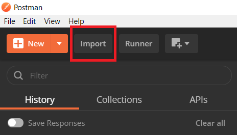

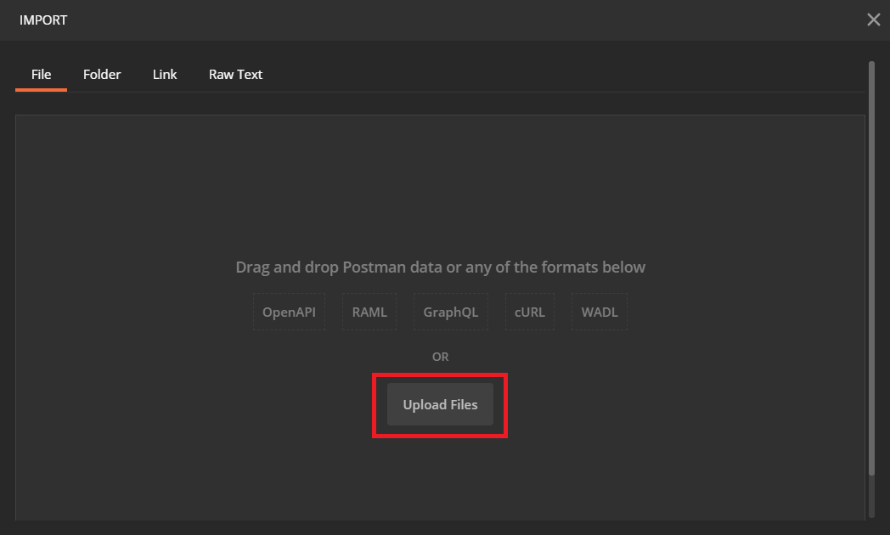

Wybieramy plik z kolekcją requestów

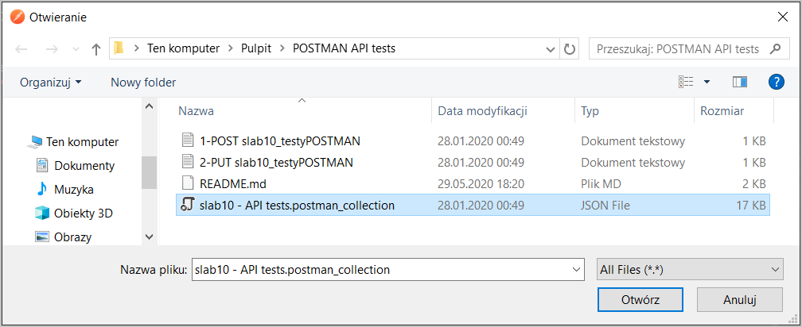

Zatwierdzamy Import

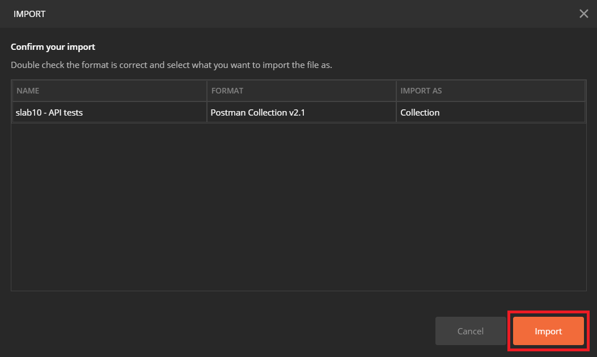

Po zaimportowaniu, w panelu kolecji powinny być widoczne 29 nowe requesty

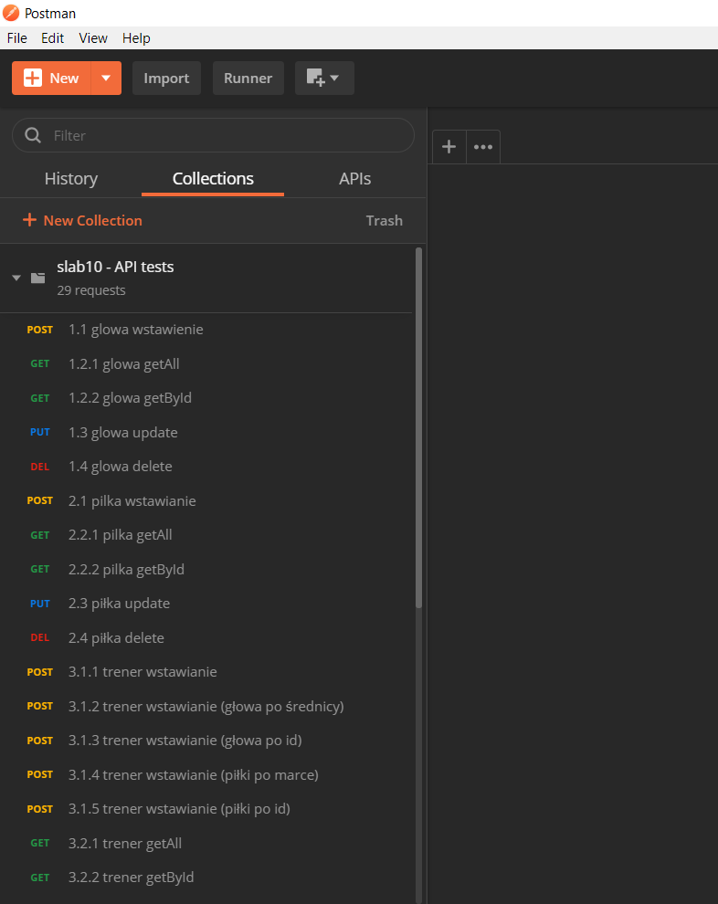

## Prezentacja kilku przykładowych testów:  
#### 1. Wyświetlenie wszystkich rekordów z tabeli 'Glowa' za pomocą requestu GET o nazwie '1.2.1 glowa getAll'

Wynik wykonanego zapytania:  
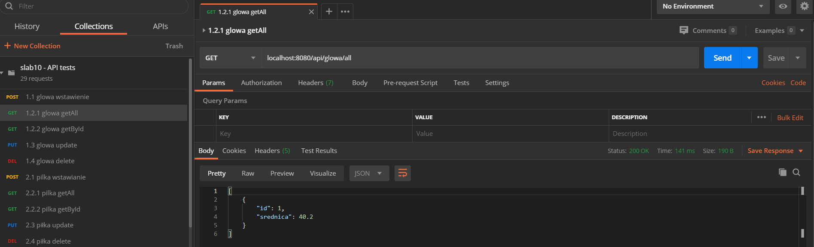  
W bazie danych sprawdzamy czy zwrócona odpowiedź na zapytanie jest zgodna z prawdą:  
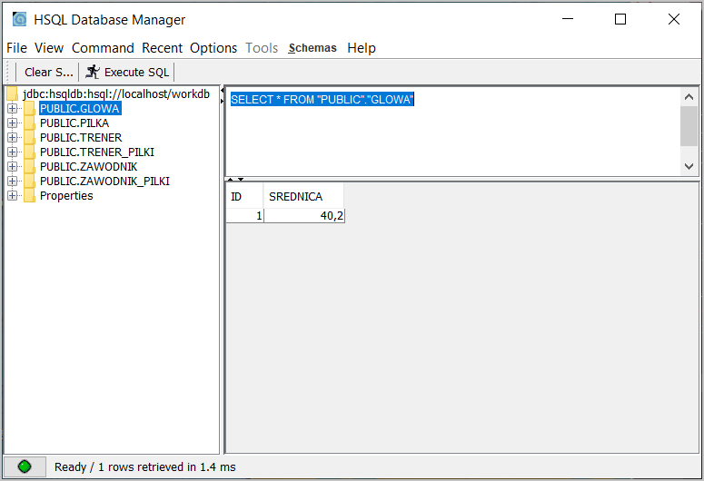  
Tak - w bazie danych znajduje się dokładnie ten 1 rekord, który został zwrócony w odpowiedzi na nasze zapytanie GET.

#### 2. Wstawienie rekordu do tabeli 'Glowa' za pomocą requestu POST o nazwie '1.1 glowa wstawienie'

Przed wykonaniem zapytania POST wstawienia sprawdzimy stan tabeli 'Glowa' korzystając z zapytania GET z punktu 1:  
  
W tabeli jest 1 rekord.  

Wynik wykonania zapytania POST wstawienia rekordu do tabeli 'Glowa':  
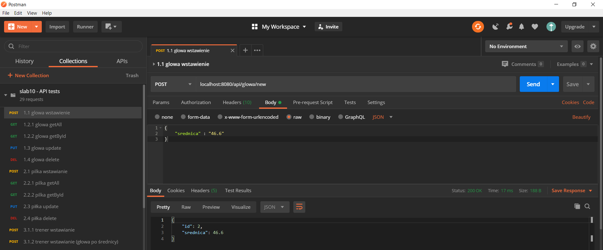  

Po wykonaniu zapytania POST wstawienia ponownie sprawdzamy stan tabeli 'Glowa'  
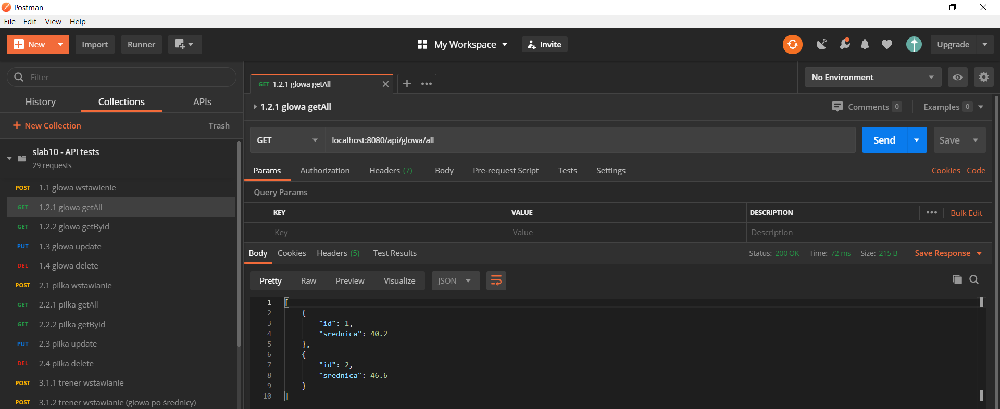  
Teraz w tabeli są 2 rekordy i wśród nich jest nowo dodany.  

#### 3. Wyświetlenie pojedynczego rekordu na podstawie podanego Id za pomocą zapytania GET o nazwie '1.2.2 glowa getById'

Wynik wykonania zapytania z parametrem Id==1:  
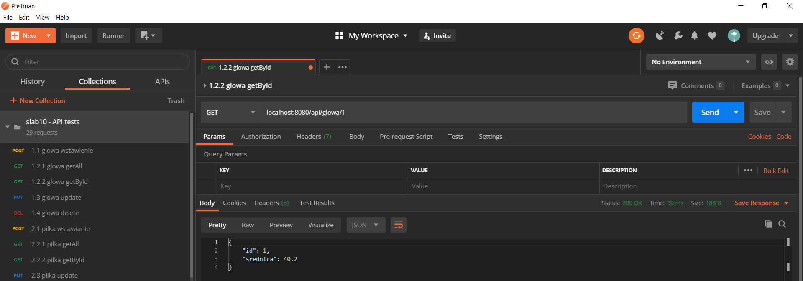  

#### 4. Zmiana pojedynczego rekordu w tabeli 'Glowa' na podstawie Id za pomocą zapytania PUT o nazwie '1.3 glowa update'

Wynik wykonania zapytania PUT z parametrem Id==1:  
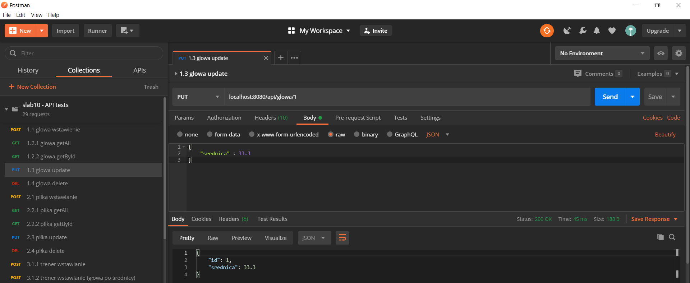  

Po wykonaniu zapytania PUT sprawdzamy stan rekordu z Id==1 w tabeli 'Glowa' korzystając 
z zapytania GET w punktu 3.  
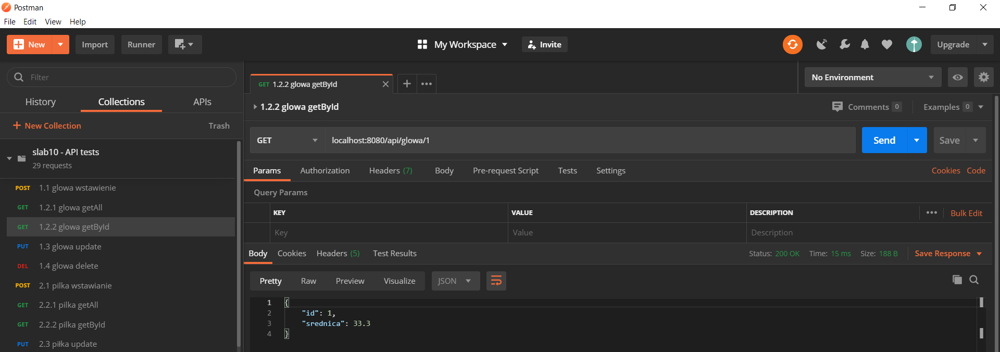  
Jak widać, wartość pola 'srednia' została poprawnie zmieniona na nową.

#### 5. Skasowanie pojedynczego rekordu z tabeli 'Glowa' na podstawie Id za pomocą zapytania DELETE o nazwie '1.4 glowa delete'

Przed wykonaniem zapytania DELETE sprawdzamy stan tabeli 'Glowa' uzywajac zapytania GET z punktu 1:  
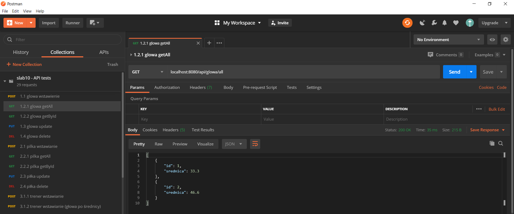  
W tabeli 'Glowa' znajdują się 2 rekordy - jeden z Id==1, a drugi z Id==2.

Wynik wykonania zapytania DELETE z parametrem Id==2:  
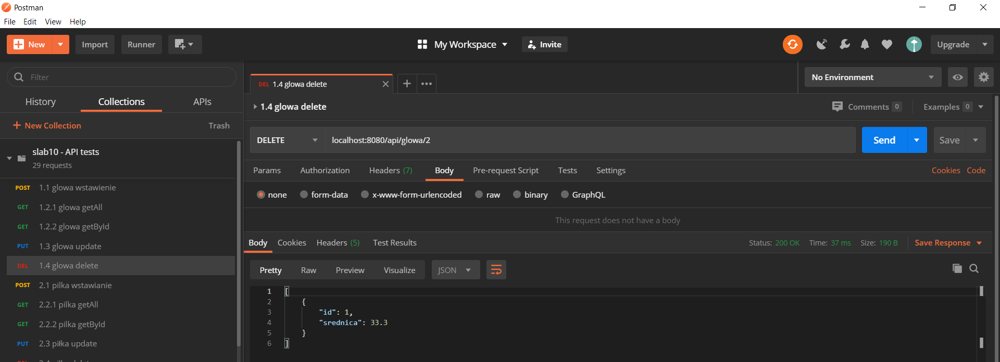  

Po wykonaniu zapytania DELETE ponownie sprawdzamy stan tabeli 'Glowa':  
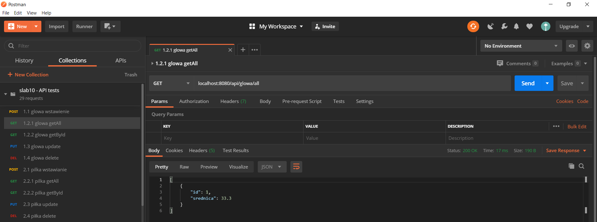  
Teraz w tabeli znajduje się tylko 1 rekord z Id==1.  

## Autor
- Jakub Skrzypiec (@jakub.skrzypiec - jakub.skrzypiec1@gmail.com)

