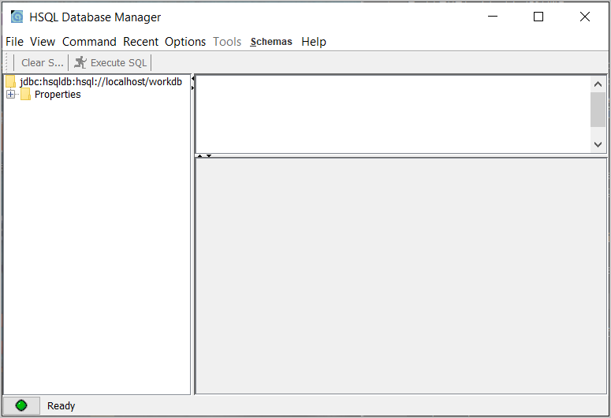

# SpringMVC2019
Prosta aplikacja WEBOWA oraz REST API (główny nacisk na API). Celem aplikacji było umożliwienie 
operacji CRUD na kilku testowych klasach, mapowanie klas i relacji między nimi 
(rodzaje relacji  między encjami: one-to-one[1:1]), many-to-one[N:1] oraz many-to-many[N:M]).  

Związki pomiędzy encjami:
- Trener (1:1) Głowa
- Pilka (N:1) Trener
- Zawodnik (N:M) Pilka 

Do utworzonego REST API przygotowałem testy w Postmanie. Testy znajdują się katalogu 'POSTMAN 
API tests'. Plik z rozszerzeniem .JSON zawiera kolekcję requestów, które mają przetestować 
różne funkcjonalności przygotowanego REST API. 2 pliki tekstowe znajdujące się w katalogu 
testów zawierają przykładowe dane wysyłane wraz z requestami typu POST oraz PUT.  

## Getting started 
Przed uruchomieniem aplikacji należy uruchomić serwer bazy danych HSQLDB - wystarczy 
z poziomu głównego katalogu repozytorium uruchomić skrypt 'runHSQLDBServer' znajdujący się
w katalogu 'db'.  
`./db/runHSQLDBServer`  
Aby łatwiej obserwować zmiany w bazie danych można uruchomić aplikacje 'HSQL Database 
Manager', w której możemy na bieżąco wyświetlać strukturę bazy danych oraz 
przeglądać zawartości tabel w bazie:  
`./db/runHSQLDBClient`  

Aplikacja 'HSQL Database Manager'  

Po tym można uruchomić główną aplikację.

## Build With:  
- Java 
- Spring Framework
- Spring Data
- Thymeleaf
- HsqlDB
- Postman (REST API tests)

## Autor
- Jakub Skrzypiec (@jakub.skrzypiec - jakub.skrzypiec1@gmail.com)

